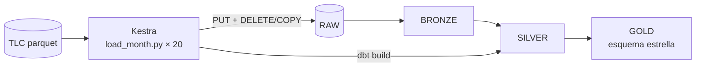

# Laboratorio Integrador I — ELT NYC Yellow Taxi

Tubería ELT reproducible que ingiere los viajes de **NYC Yellow Taxi (enero 2025 → agosto 2026)** a **Snowflake** y los modela con **dbt** en una arquitectura **Bronze → Silver → Gold**, orquestada con **Kestra** en Docker.

- Arquitectura: [`docs/architecture.md`](docs/architecture.md)
- Esquema estrella: [`docs/star_schema.md`](docs/star_schema.md)
- Diseño y decisiones: [`docs/design.md`](docs/design.md) · Plan de implementación: [`docs/plan.md`](docs/plan.md)



## Estructura

```
semana-07/
├── docker-compose.yml          # Postgres (metadata) + Kestra + flow-deployer
├── infra/
│   ├── kestra.Dockerfile       # Kestra v1.3.37 + venv con dbt-snowflake, pyarrow, requests
│   └── deploy_flows.sh         # publica ./flows en Kestra vía API
├── snowflake/setup.sql         # warehouse, rol, usuario de servicio, DB, schemas, stage, tabla RAW
├── ingestion/
│   ├── load_month.py           # descarga 1 mes → stage → DELETE + COPY (idempotente)
│   ├── counts.py               # filas por período en RAW
│   └── tests/                  # pytest
├── flows/
│   ├── nyc_taxi_elt.yml        # ForEach 20 meses → dbt build
│   └── smoke.yml               # verificación del runtime
├── dbt/                        # seeds, bronze, silver, gold, tests
└── docs/
```

## Requisitos

- Docker Desktop (con ~4 GB de RAM para Docker)
- [uv](https://docs.astral.sh/uv/) (para el entorno local de Python 3.12)
- Una cuenta de Snowflake (el trial sirve) con acceso a `ACCOUNTADMIN`
- `openssl`

## Puesta en marcha

Todos los comandos se ejecutan desde `Laboratorios/semana-07/`.

### 1. Entorno local

```bash
uv venv -p 3.12 .venv
uv pip install -p .venv/bin/python -r requirements.txt -r requirements-dev.txt
cp .env.example .env
```

> dbt aún no soporta Python 3.14; por eso el venv usa 3.12.

### 2. Llave para el usuario de servicio de Snowflake

Snowflake no permite usuarios con solo contraseña sin MFA, así que el pipeline usa **key-pair**:

```bash
mkdir -p .secrets
openssl genrsa 2048 | openssl pkcs8 -topk8 -inform PEM -out .secrets/rsa_key.p8 -nocrypt
openssl rsa -in .secrets/rsa_key.p8 -pubout -out .secrets/rsa_key.pub
chmod 600 .secrets/rsa_key.p8
```

### 3. Objetos en Snowflake

1. En Snowsight (la interfaz web de Snowflake) → **Projects → Workspaces** → nueva SQL worksheet → pegar [`snowflake/setup.sql`](snowflake/setup.sql) → **Run All**.
2. Registrar la llave pública del usuario del pipeline. Este comando imprime la sentencia a ejecutar en la misma worksheet:

   ```bash
   echo "USE ROLE ACCOUNTADMIN; ALTER USER NYC_PIPELINE SET RSA_PUBLIC_KEY='$(grep -v -- '-----' .secrets/rsa_key.pub | tr -d '\n')';"
   ```

3. Completar `.env`:
   - `SNOWFLAKE_ACCOUNT`: account identifier (`ORGNAME-ACCOUNTNAME`, en Snowsight → menú de la cuenta → *Connect a tool to Snowflake*).
   - `SNOWFLAKE_PRIVATE_KEY_PATH`: ruta absoluta a la llave (`echo "$PWD/.secrets/rsa_key.p8"`).
   - `KESTRA_USER` / `KESTRA_PASSWORD`: login de Kestra (usuario = email; contraseña ≥ 8 caracteres con mayúscula y número).

Verificación:

```bash
set -a; source .env; set +a
cd dbt && ../.venv/bin/dbt deps && ../.venv/bin/dbt debug   # → All checks passed!
```

### 4. Levantar la infraestructura

```bash
docker compose up -d --build
```

Si Docker tiene configurado un builder `docker-container` (p. ej. `multiarch`), usar el builder local para no volver a descargar la imagen base de ~3 GB:

```bash
BUILDX_BUILDER=desktop-linux docker compose up -d --build
```

`flow-deployer` publica automáticamente los flows de `./flows` cuando Kestra está listo. UI: <http://localhost:8080> (credenciales de `.env`).

## Ejecutar el pipeline

**Desde la UI:** Flows → `usfq.nyc_taxi` → `nyc_taxi_elt` → **Execute**. En la ejecución, la pestaña **Gantt** muestra cada mes y luego `dbt_build`; la pestaña **Logs** muestra `LOADED <mes> rows=<n>`.

**Desde la terminal:**

```bash
set -a; source .env; set +a
curl -u "$KESTRA_USER:$KESTRA_PASSWORD" -X POST \
  http://localhost:8080/api/v1/main/executions/usfq.nyc_taxi/nyc_taxi_elt
```

El flow:

1. `ingest` — `ForEach` sobre los 20 períodos (uno a la vez) ejecuta `ingestion/load_month.py <YYYY-MM>`:
   - `HEAD` a la URL de la TLC; si responde 403/404 registra `NOT_PUBLISHED` y continúa.
   - Descarga por streaming a un directorio temporal (se borra al terminar), `PUT` al stage `RAW.TLC_STAGE`.
   - En una transacción: `DELETE` del período + `COPY INTO RAW.YELLOW_TRIPDATA` (con `_SOURCE_FILE` y `_LOADED_AT`) + asignación de `_SOURCE_PERIOD`; si las filas cargadas ≠ filas del parquet, `ROLLBACK`.
2. `dbt_build` — `dbt deps && dbt build`: 4 seeds, 11 modelos y 55 tests.

Duración observada: ~17–20 min por ejecución completa, ingesta + dbt (warehouse XSMALL).

Si se edita un flow: `./infra/deploy_flows.sh` (con `.env` cargado) lo vuelve a publicar.

## Verificar

```bash
set -a; source .env; set +a
.venv/bin/pytest ingestion/tests -v          # 16 tests
.venv/bin/python ingestion/counts.py         # filas por período en RAW
cd dbt && ../.venv/bin/dbt build             # PASS=70 (4 seeds + 11 modelos + 55 tests)
```

Consulta de ejemplo (ingreso por borough, julio 2026):

```bash
cd dbt && ../.venv/bin/dbt show --inline "
  select l.borough, count(*) as viajes, round(sum(f.total_amount)) as ingreso_usd
  from {{ ref('fct_trips') }} f
  join {{ ref('dim_date') }} d on f.pickup_date_key = d.date_key
  join {{ ref('dim_location') }} l on f.pickup_location_id = l.location_id
  where d.year = 2026 and d.month = 7
  group by 1 order by ingreso_usd desc"
```

| Borough | Viajes | Ingreso (USD) |
|---|---:|---:|
| Manhattan | 3 027 234 | 79 219 678 |
| Queens | 308 478 | 20 962 371 |
| Brooklyn | 101 245 | 3 756 796 |

## Capas

### Bronze — `BRONZE.bronze_yellow_tripdata` (view)

Reflejo 1:1 de `RAW.YELLOW_TRIPDATA` con los nombres y valores de la fuente, más la metadata de origen:

| Columna | Contenido |
|---|---|
| `_source_file` | ruta del archivo en el stage (`yellow/2025-01/yellow_tripdata_2025-01.parquet`) |
| `_source_period` | período `YYYY-MM` del archivo |
| `_loaded_at` | momento de la carga |

### Silver — `SILVER.silver_trips` y `SILVER.silver_trips_rejected` (tablas)

| Dimensión de calidad | Regla | Justificación |
|---|---|---|
| Nombres y formatos | snake_case: `VendorID`→`vendor_id`, `tpep_pickup_datetime`→`pickup_at`, `PULocationID`→`pickup_location_id`, `RatecodeID`→`rate_code_id`, `payment_type`→`payment_type_id`; `store_and_fwd_flag` Y/N → BOOLEAN | La fuente mezcla CamelCase, abreviaturas y `Airport_fee` con mayúscula |
| Tipos | timestamps `TIMESTAMP_NTZ`, IDs `INT`, montos y distancia `NUMBER(12,2)` | RAW usa tipos amplios para absorber cambios entre meses; Silver fija tipos analíticos |
| Nulos | `rate_code_id` nulo → 99 (código oficial *Unknown*); recargos nulos (`congestion_surcharge`, `airport_fee`, `cbd_congestion_fee`) → 0; `passenger_count` nulo **se conserva** | Recargo nulo = no aplicó. El 24.5 % de los viajes (Flex Fare, `payment_type = 0`) no trae pasajeros; imputar un valor sesgaría los promedios |
| Duplicados | `trip_id` = md5(vendor, pickup, dropoff, zonas, fare, total, período) y `ROW_NUMBER()` por `trip_id` | La fuente no trae identificador de viaje |
| Registros inválidos | se excluyen: timestamps nulos, zonas fuera de 1–265, pickup fuera del mes del archivo, duración ≤ 0 o > 24 h, distancia < 0 o > 500 mi, `total_amount` < 0 | Físicamente imposibles o fuera del período (hay pickups de 2008 en archivos de 2026). Los montos negativos (reembolsos/disputas) distorsionarían el ingreso |

Resultado sobre los 19 meses cargados:

| Concepto | Filas | % de Bronze |
|---|---:|---:|
| Bronze | 75 089 241 | 100 % |
| **Silver (válidos)** | **73 076 434** | 97.32 % |
| Rechazados | 1 999 255 | 2.66 % |
| Duplicados eliminados | 13 552 | 0.02 % |

| Motivo de rechazo | Filas | % de Bronze |
|---|---:|---:|
| `negative_or_missing_amount` | 1 120 920 | 1.493 % |
| `non_positive_duration` | 874 801 | 1.165 % |
| `invalid_distance` | 2 617 | 0.003 % |
| `duration_over_24h` | 572 | 0.001 % |
| `pickup_out_of_period` | 345 | < 0.001 % |
| `invalid_location` / `missing_timestamp` | 0 | 0 % |

Los rechazados no se pierden: quedan en `silver_trips_rejected` con su `rejection_reason`. El test `reconciliation_bronze_silver` garantiza **Bronze = Silver + rechazados + duplicados**.

### Gold — esquema estrella

Grano de `fct_trips`: **un viaje válido**. Detalle de PKs, FKs, métricas y atributos en [`docs/star_schema.md`](docs/star_schema.md).

| Tabla | PK | Uso |
|---|---|---|
| `fct_trips` | `trip_id` | métricas del viaje (distancia, duración, tarifa, propina, recargos, total) |
| `dim_date` | `date_key` (YYYYMMDD) | fecha de pickup y dropoff (role-playing) |
| `dim_time` | `hour_key` (0–23) | franja del día, hora pico |
| `dim_location` | `location_id` | borough/zona de pickup y dropoff (role-playing) |
| `dim_vendor` | `vendor_id` | proveedor TPEP |
| `dim_payment_type` | `payment_type_id` | forma de pago |
| `dim_rate_code` | `rate_code_id` | tarifa |

Los catálogos incluyen miembros *Unknown* (`vendor_id = -1`, `payment_type_id = 5`, `rate_code_id = 99`); `fct_trips` redirige cualquier código fuera de catálogo a ese miembro, así ninguna FK queda huérfana.

## Pruebas dbt

| Tipo | Dónde |
|---|---|
| `unique` + `not_null` | PK de cada dimensión y seed, `fct_trips.trip_id`, `silver_trips.trip_id` |
| `not_null` | FKs de `fct_trips`; metadata de Bronze; timestamps y montos de Silver |
| `relationships` | las 8 FKs de `fct_trips` → su dimensión |
| `accepted_values` | `_source_period` (20 períodos) y `rejection_reason` |
| `dbt_utils.expression_is_true` | `dropoff_at > pickup_at`, `total_amount >= 0` |
| singular | `reconciliation_bronze_silver`, `gold_fact_matches_silver` |

## Idempotencia

- **Ingesta:** `DELETE` del período + `COPY` en una sola transacción; recargar un mes lo reemplaza.
- **dbt:** Bronze es view; Silver y Gold son tablas reconstruidas por completo en cada `dbt build`.
- **Evidencia:** dos ejecuciones consecutivas del flow producen conteos idénticos por período en RAW (`counts.py` + `diff`) y el mismo número de filas en `fct_trips`. La prueba se hizo también desde cero (`DROP DATABASE NYC_TAXI` → `setup.sql` → `docker compose down -v && up` → flow).

## Limitación de datos

Al 2026-09-28 la TLC aún no publica **agosto 2026** (la URL responde 403; la TLC publica con ~2 meses de retraso). El flow lo registra como `NOT_PUBLISHED 2026-08` sin fallar. Cuando se publique, basta con volver a ejecutar `nyc_taxi_elt`: se cargará sin duplicar los meses existentes.

## Desarrollo local

```bash
set -a; source .env; set +a
.venv/bin/python ingestion/load_month.py 2025-01   # cargar un mes sin Kestra
cd dbt && ../.venv/bin/dbt build --select silver_trips+
```
