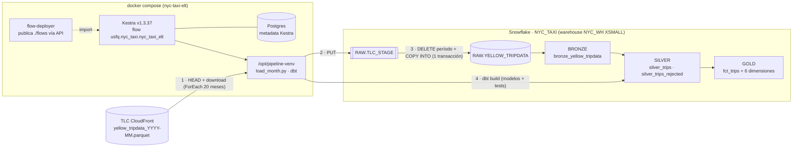

# Arquitectura

| Paso | Componente | Idempotencia |
|---|---|---|
| Ingesta | `ingestion/load_month.py` | DELETE del período + COPY en una transacción; verifica filas parquet = filas cargadas |
| Bronze | view dbt | reflejo 1:1 de RAW |
| Silver / Gold | tablas dbt | reconstrucción completa en cada `dbt build` |
