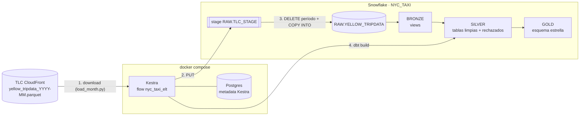
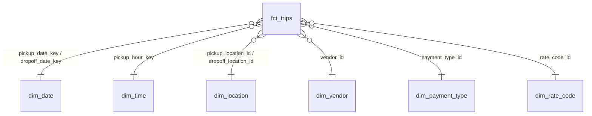

# Laboratorio Integrador I — Diseño

Tubería ELT reproducible para NYC Yellow Taxi (ene-2025 → ago-2026) con Kestra, Snowflake y dbt, organizada en Bronze → Silver → Gold.

- **Fecha:** 2026-09-28
- **Estado:** aprobado

## 1. Objetivo y criterios de éxito

Ejecutar el pipeline desde cero y obtener en Snowflake las capas Bronze, Silver y Gold listas para análisis, de forma que:

1. Se ingieren automáticamente los 20 meses de NYC Yellow Taxi (2025-01 … 2026-08).
2. Los datos originales quedan en Snowflake con metadata de origen (archivo, período) y fecha de carga.
3. Silver aplica y justifica reglas de calidad (tipos, nulos, duplicados, inválidos, nombres/formatos).
4. Gold expone un esquema estrella con grano, PKs, FKs, métricas y atributos definidos.
5. `dbt build` pasa, incluyendo `not_null`, `unique` y `relationships`.
6. Re-ejecutar el pipeline no genera duplicados ni cambia los conteos.

### Restricciones conocidas

- **Disponibilidad de datos:** al 2026-09-28 la TLC publica hasta 2026-07; `yellow_tripdata_2026-08.parquet` responde 403. La ingesta debe tolerar meses no publicados (registrar y continuar) y cargarlos en una corrida posterior sin duplicar.
- **Snowflake:** cuenta trial personal (rol `ACCOUNTADMIN`). Usar warehouse XSMALL con auto-suspend para cuidar créditos.
- **Cambios de esquema en la fuente:** los parquet de la TLC varían entre meses (p. ej. `cbd_congestion_fee` aparece en 2025; `passenger_count` alterna int/double).
- **Credenciales:** nunca se commitean. `.env` va en `.gitignore`; se versiona `.env.example`.

## 2. Arquitectura



### Estructura del repositorio

```
Laboratorios/semana-07/
├── docker-compose.yml        # Kestra + Postgres (metadata de Kestra)
├── .env.example              # plantilla de credenciales
├── snowflake/setup.sql       # warehouse, DB, schemas, stage, file format
├── ingestion/
│   ├── load_month.py         # descarga 1 mes → RAW (idempotente)
│   └── requirements.txt
├── flows/nyc_taxi_elt.yml    # flow Kestra: ingesta de 20 meses → dbt build
├── dbt/                      # proyecto dbt (seeds, bronze, silver, gold, tests)
├── docs/
│   ├── design.md             # este documento
│   ├── architecture.md       # diagrama de arquitectura
│   └── star_schema.md        # diagrama del esquema estrella
└── README.md                 # instrucciones para levantar y ejecutar
```

## 3. Componentes

### 3.1 Snowflake (`snowflake/setup.sql`)

- Warehouse `NYC_WH` — XSMALL, `AUTO_SUSPEND = 60`, `AUTO_RESUME = TRUE`.
- Base `NYC_TAXI` con schemas `RAW`, `BRONZE`, `SILVER`, `GOLD`.
- File format `RAW.PARQUET_FF` (`TYPE = PARQUET`, `USE_LOGICAL_TYPE = TRUE` para que los timestamps lleguen como timestamps).
- Stage interno `RAW.TLC_STAGE`.
- Tabla `RAW.YELLOW_TRIPDATA`: columnas de la fuente con nombres originales, tipos amplios (NUMBER / FLOAT / TIMESTAMP_NTZ / VARCHAR) para absorber cambios de tipo entre meses, más `_SOURCE_FILE`, `_SOURCE_PERIOD`, `_LOADED_AT`.
- El script es idempotente (`CREATE ... IF NOT EXISTS`).

### 3.2 Ingesta (`ingestion/load_month.py`)

Entrada: un período `YYYY-MM`. Credenciales desde variables de entorno.

1. `HEAD` a la URL de la TLC. Si 403/404 → log `NOT_PUBLISHED <periodo>` y salir con código 0.
2. Descargar el parquet a un directorio temporal.
3. `PUT` al stage bajo `yellow/<periodo>/` (`OVERWRITE = TRUE`).
4. En una transacción:
   - `DELETE FROM RAW.YELLOW_TRIPDATA WHERE _SOURCE_PERIOD = <periodo>`;
   - `COPY INTO RAW.YELLOW_TRIPDATA` con `MATCH_BY_COLUMN_NAME = CASE_INSENSITIVE`, `INCLUDE_METADATA = (_SOURCE_FILE = METADATA$FILENAME, _LOADED_AT = METADATA$START_SCAN_TIME)` y `FORCE = TRUE` (Snowflake no permite combinar `MATCH_BY_COLUMN_NAME` con un `SELECT` de transformación);
   - `UPDATE ... SET _SOURCE_PERIOD = <periodo> WHERE _SOURCE_PERIOD IS NULL`;
   - `COMMIT`.
5. Verificar que filas cargadas = filas del parquet (metadata de pyarrow); si no coinciden → error.

Se puede ejecutar standalone (`python load_month.py 2025-01`) para desarrollo y pruebas.

### 3.3 Orquestación (Kestra, `flows/nyc_taxi_elt.yml`)

- Infra: `docker-compose.yml` basado en semana-03 (Kestra + Postgres), sin el warehouse Postgres ni pgAdmin (los reemplaza Snowflake). Monta `flows/`, `ingestion/` y `dbt/`; recibe credenciales de Snowflake desde `.env`.
- Flow `nyc_taxi_elt`:
  1. `ForEach` sobre los 20 períodos → ejecuta `load_month.py` (Python task con `snowflake-connector-python` y `pyarrow`).
  2. `dbt deps` + `dbt build` (plugin `DbtCLI` con `dbt-snowflake`).
- Un fallo real (no un mes no publicado) detiene el flow.

### 3.4 dbt (`dbt/`)

Paquetes: `dbt_utils`. Perfil `nyc_taxi` leyendo credenciales de variables de entorno (`env_var`). Materializaciones: Bronze = view, Silver = table, Gold = table (reconstrucción completa → idempotente por construcción).

#### Seeds

`taxi_zone_lookup` (265 zonas oficiales), `vendor`, `payment_type` (incluye 0 = Flex Fare), `rate_code` (incluye 99 = Unknown). Fuente: diccionario de datos oficial de la TLC.

#### Bronze

`bronze_yellow_tripdata` — view 1:1 sobre `RAW.YELLOW_TRIPDATA`: mismos nombres y valores, más metadata `_source_file`, `_source_period`, `_loaded_at`.

#### Silver

`silver_trips` (válidos) y `silver_trips_rejected` (con `rejection_reason`), construidos desde un modelo intermedio común que estandariza y evalúa reglas.

| Dimensión de calidad | Regla | Justificación |
|---|---|---|
| Nombres y formatos | snake_case: `VendorID`→`vendor_id`, `tpep_pickup_datetime`→`pickup_at`, `tpep_dropoff_datetime`→`dropoff_at`, `PULocationID`→`pickup_location_id`, `DOLocationID`→`dropoff_location_id`, `RatecodeID`→`rate_code_id`, `payment_type`→`payment_type_id`; `store_and_fwd_flag` Y/N → BOOLEAN | La fuente mezcla CamelCase y abreviaturas |
| Tipos | timestamps `TIMESTAMP_NTZ`; IDs `INT`; montos `NUMBER(10,2)`; `trip_distance NUMBER(10,2)`; `passenger_count INT` | Tipos inconsistentes entre meses |
| Nulos | `rate_code_id` nulo → 99 (código oficial "Unknown"); `passenger_count` nulo se mantiene nulo; `congestion_surcharge`, `airport_fee`, `cbd_congestion_fee` nulos → 0 | Recargo nulo = no aplicó. Imputar pasajeros sesgaría promedios |
| Duplicados | `trip_id = md5(vendor_id, pickup_at, dropoff_at, pickup_location_id, dropoff_location_id, fare_amount, total_amount, _source_period)`; `QUALIFY ROW_NUMBER() OVER (PARTITION BY trip_id ORDER BY _loaded_at DESC) = 1` | La fuente no tiene ID de viaje |
| Registros inválidos (→ rechazados) | `dropoff_at <= pickup_at`; duración > 24 h; `trip_distance < 0` o `> 500`; `total_amount < 0` (reembolsos/disputas); location fuera de 1–265; `pickup_at` fuera del mes de `_source_period` | Físicamente imposibles o fuera del período del archivo. Los negativos distorsionarían métricas de ingreso |

Cada registro rechazado conserva su primer motivo de rechazo en `rejection_reason`.

#### Gold — esquema estrella



**`fct_trips`**

- Grano: un registro por viaje válido (= una fila de `silver_trips`).
- PK: `trip_id`.
- FKs: `pickup_date_key`, `dropoff_date_key` → `dim_date`; `pickup_hour_key` → `dim_time`; `pickup_location_id`, `dropoff_location_id` → `dim_location`; `vendor_id` → `dim_vendor`; `payment_type_id` → `dim_payment_type`; `rate_code_id` → `dim_rate_code`.
- Métricas: `passenger_count`, `trip_distance`, `trip_duration_minutes`, `fare_amount`, `extra`, `mta_tax`, `tip_amount`, `tolls_amount`, `improvement_surcharge`, `congestion_surcharge`, `airport_fee`, `cbd_congestion_fee`, `total_amount`.
- Atributos degenerados: `store_and_fwd_flag`, `_source_period`.

**Dimensiones**

| Dimensión | PK | Atributos | Origen |
|---|---|---|---|
| `dim_date` | `date_key` INT (YYYYMMDD) | `full_date`, `year`, `quarter`, `month`, `month_name`, `day_of_month`, `day_of_week`, `day_name`, `is_weekend` | `dbt_utils.date_spine` 2025-01-01 → 2026-12-31 |
| `dim_time` | `hour_key` (0–23) | `hour_label`, `day_part` (madrugada/mañana/tarde/noche), `is_rush_hour` | generada |
| `dim_location` | `location_id` | `borough`, `zone`, `service_zone` | seed `taxi_zone_lookup` |
| `dim_vendor` | `vendor_id` | `vendor_name` | seed |
| `dim_payment_type` | `payment_type_id` | `payment_type_name` | seed |
| `dim_rate_code` | `rate_code_id` | `rate_code_name` | seed |

Decisiones: llaves naturales (catálogos pequeños y estables definidos por la TLC); `dim_date` y `dim_location` son role-playing; los catálogos incluyen miembros "Unknown" para que no existan FKs huérfanas.

## 4. Validación

### Tests dbt

| Tipo | Aplicación |
|---|---|
| `unique` + `not_null` | PK de cada dimensión, `fct_trips.trip_id`, `silver_trips.trip_id` |
| `not_null` | todas las FKs de `fct_trips`; `pickup_at`, `dropoff_at`, `total_amount` en Silver |
| `relationships` | las 8 FKs de `fct_trips` → dimensión correspondiente |
| `accepted_values` | `_source_period` ∈ los 20 períodos esperados |
| `dbt_utils.expression_is_true` | `dropoff_at > pickup_at`, `total_amount >= 0` en `silver_trips` |
| Singular: reconciliación | filas Bronze = Silver + rechazados + duplicados eliminados |
| Singular: Gold completo | `count(fct_trips) = count(silver_trips)` |

### Idempotencia

- Ingesta: `DELETE` del período + `COPY` en una transacción → recargar un mes lo reemplaza.
- dbt: modelos `table`/`view` reconstruidos por completo en cada corrida.
- Verificación: dos corridas consecutivas producen conteos idénticos por `_source_period` en RAW, Silver y Gold.

## 5. Roadmap con hitos verificables

| Fase | Entregable | Hito verificable |
|---|---|---|
| F0 — Base local | `semana-07/`, `.gitignore`, `.env.example`, venv con `dbt-snowflake` | `dbt --version` lista el adapter snowflake; `git check-ignore .env` confirma que está ignorado |
| F1 — Snowflake | `snowflake/setup.sql` | `SHOW SCHEMAS IN DATABASE NYC_TAXI` muestra RAW, BRONZE, SILVER, GOLD; `dbt debug` → *All checks passed* |
| F2 — Infraestructura | `docker-compose.yml` | `docker compose ps` todo en estado running/healthy; `http://localhost:8080` responde |
| F3 — Ingesta 1 mes | `ingestion/load_month.py` | 2025-01 cargado; conteo en Snowflake = filas del parquet; re-ejecución no cambia el conteo |
| F4 — Ingesta orquestada | `flows/nyc_taxi_elt.yml` (paso de ingesta) | 19 períodos cargados, 2026-08 registrado como `NOT_PUBLISHED` sin fallar el flow; 2.ª corrida → conteos idénticos |
| F5 — Bronze + Silver | seeds, modelos y tests de Bronze/Silver | `dbt build --select bronze silver` en verde; test de reconciliación pasa; resumen de rechazos por motivo |
| F6 — Gold | modelos y tests de Gold; paso dbt en el flow | `dbt build` completo en verde; query de ejemplo (ingreso por borough y mes) devuelve resultados coherentes |
| F7 — Desde cero | — | Drop de schemas → flow completo en Kestra en verde; 2.ª corrida → conteos idénticos |
| F8 — Entrega | `docs/architecture.md`, `docs/star_schema.md`, `README.md` | Diagramas Mermaid renderizan en GitHub; los pasos del README funcionan en un clone limpio |

No se avanza de fase hasta que su hito esté en verde.

## 6. Fuera de alcance

- Otros tipos de taxi (green, FHV) y otros años.
- Cargas incrementales en dbt (el volumen permite reconstrucción completa en XSMALL).
- Scheduling recurrente del flow (se ejecuta manualmente).
- CI/CD.
