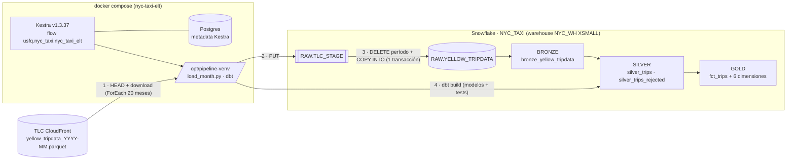
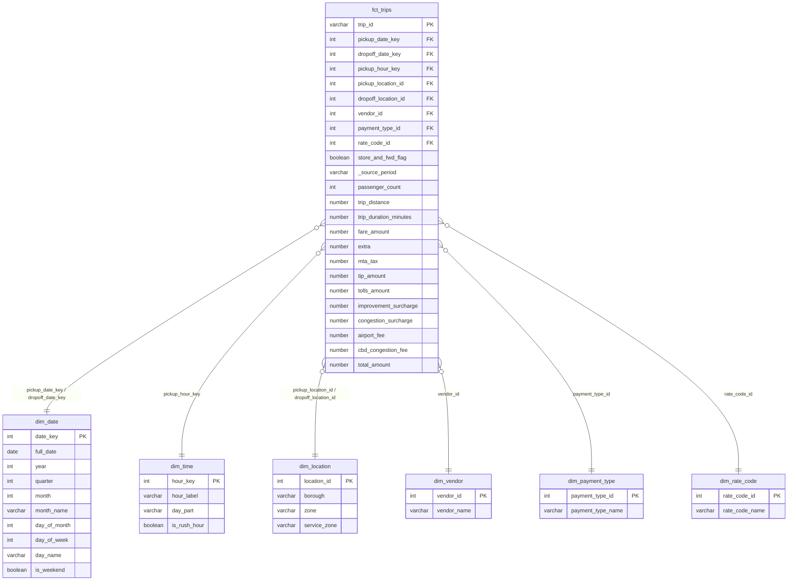

# Laboratorio Integrador I — Plan de implementación

> **Para agentes:** SUB-SKILL REQUERIDO: usar superpowers:executing-plans (o superpowers:subagent-driven-development) para implementar este plan tarea por tarea. Los pasos usan checkboxes (`- [ ]`).

**Goal:** Pipeline ELT reproducible que ingiere 20 meses de NYC Yellow Taxi a Snowflake y los modela con dbt en Bronze → Silver → Gold (esquema estrella), orquestado con Kestra.

**Architecture:** Kestra (Docker, imagen propia con un venv de Python que trae `dbt-snowflake`) ejecuta por cada mes `ingestion/load_month.py` (download → PUT al stage → DELETE+COPY idempotente en `RAW`) y después `dbt build`. dbt materializa Bronze (views), Silver (tablas limpias + rechazados) y Gold (hechos + dimensiones), con tests.

**Tech Stack:** Docker Compose, Kestra v1.3.37 (task runner `Process`), Postgres 17 (metadata de Kestra), Snowflake (trial, autenticación key-pair), Python 3.12 (uv), `dbt-snowflake==1.12.1`, `dbt_utils` 1.4.1, pytest.

**Spec:** `Laboratorios/semana-07/docs/design.md`

## Global Constraints

- Todo vive bajo `Laboratorios/semana-07/`. Las rutas del plan son relativas a esa carpeta salvo que se diga otra cosa.
- Períodos: `2025-01` … `2026-08` (20). Al 2026-09-28, `2026-08` responde 403 → se registra `NOT_PUBLISHED` y el flow no falla.
- Python **3.12** (el `python3` del sistema es 3.14 y dbt no lo soporta) → `uv venv -p 3.12`.
- Credenciales nunca en git: `.env` y `.secrets/` en `.gitignore`; se versiona `.env.example`.
- Snowflake: warehouse `NYC_WH` XSMALL, `AUTO_SUSPEND = 60`; base `NYC_TAXI`; schemas `RAW`, `BRONZE`, `SILVER`, `GOLD`; rol `NYC_PIPELINE_ROLE`; usuario de servicio `NYC_PIPELINE` con key-pair (Snowflake bloquea password sin MFA en usuarios nuevos).
- Commits **sin** línea `Co-Authored-By`.
- Idempotencia: la ingesta hace DELETE del período + COPY en una transacción; los modelos dbt son `view`/`table` (reconstrucción completa).

## Hallazgos que ajustan el spec

Revisé los parquet reales (2025-01, 2025-06, 2026-01, 2026-07):

- El esquema es estable, **pero en 2026 aparece `request_source`** (VARCHAR, nullable) → se agrega a RAW, Bronze y Silver.
- `Airport_fee` viene con la A mayúscula → `MATCH_BY_COLUMN_NAME = CASE_INSENSITIVE` lo resuelve.
- Los tipos no cambian entre estos meses (`passenger_count` y `RatecodeID` son int64). Igual RAW usa tipos amplios por robustez.
- **~15 % de las filas son Flex Fare (`payment_type = 0`)** y traen nulos en bloque en `passenger_count`, `RatecodeID`, `store_and_fwd_flag`, `congestion_surcharge` y `Airport_fee`. Confirma la regla: `passenger_count` se deja nulo y no se descartan esas filas.
- `VendorID` ∈ {1, 2, 6, 7} (6 = Myle, 7 = Helix).
- En 2025-01 el pickup va de 2024-12-31 a 2025-02-01; en 2026-07 aparece uno de **2008-12-30** → la regla `pickup_out_of_period` es necesaria.
- En 2025-01 hay 63 037 filas con `total_amount < 0` (1,8 %).
- Montos y distancias con outliers → uso `NUMBER(12,2)` en vez de `(10,2)` para que ningún cast desborde.
- En la ejecución, dbt corre con `shell.Commands` + runner `Process` dentro de la imagen de Kestra en vez del plugin `DbtCLI`: es el mismo `dbt build`, sin Docker-in-Docker.

## Review Focus

1. **Mes no publicado (403/404)** → `load_month.py` sale con código 0 y loguea `NOT_PUBLISHED`; cualquier otro código HTTP es error. Test: `test_is_published_*`.
2. **Recarga de un mes ya cargado** → los conteos por período no cambian. Test: hito F3 (dos corridas) y F7.
3. **Discrepancia filas parquet vs. cargadas** → rollback y exit 1, nunca un mes a medias. Test: `test_verify_row_count_mismatch_raises`.
4. **FKs con códigos fuera de catálogo** (vendor nuevo, payment_type nulo) → caen en el miembro "Unknown" y `relationships` sigue pasando. Test: `fct_trips` usa `coalesce` contra la dimensión + tests `relationships`.
5. **Lista de períodos desincronizada** entre el flow y el script → test `test_flow_periods_match_expected`.

## Estructura de archivos

```
Laboratorios/semana-07/
├── .gitignore
├── .env.example
├── requirements.txt              # dependencias del pipeline (local + imagen Kestra)
├── requirements-dev.txt          # pytest, pyyaml
├── docker-compose.yml
├── infra/kestra.Dockerfile       # kestra v1.3.37 + /opt/pipeline-venv
├── snowflake/setup.sql
├── ingestion/
│   ├── load_month.py             # CLI: python load_month.py YYYY-MM
│   ├── counts.py                 # CLI: conteos por período en RAW (idempotencia)
│   └── tests/test_load_month.py
├── flows/
│   ├── smoke.yml                 # verifica runtime dentro de Kestra
│   └── nyc_taxi_elt.yml          # ingesta 20 meses → dbt build
├── dbt/
│   ├── dbt_project.yml  profiles.yml  packages.yml
│   ├── macros/generate_schema_name.sql
│   ├── seeds/  (taxi_zone_lookup, vendor, payment_type, rate_code + seeds.yml)
│   ├── models/
│   │   ├── bronze/  (sources.yml, bronze_yellow_tripdata.sql, bronze.yml)
│   │   ├── silver/  (silver_trips_evaluated.sql, silver_trips.sql, silver_trips_rejected.sql, silver.yml)
│   │   └── gold/    (dim_*.sql, fct_trips.sql, gold.yml)
│   └── tests/  (reconciliation_bronze_silver.sql, gold_fact_matches_silver.sql)
├── docs/ (design.md, plan.md, architecture.md, star_schema.md)
└── README.md
```

---

## Task F0: Base local

**Files:**
- Create: `.gitignore`, `.env.example`, `requirements.txt`, `requirements-dev.txt`

**Interfaces:**
- Produces: venv `.venv/` (Python 3.12) con `dbt`, `snowflake.connector`, `pyarrow`, `requests`, `pytest`, `yaml`. Variables de entorno usadas por el resto: `SNOWFLAKE_ACCOUNT`, `SNOWFLAKE_USER`, `SNOWFLAKE_PRIVATE_KEY_PATH`, `SNOWFLAKE_ROLE`, `SNOWFLAKE_WAREHOUSE`, `SNOWFLAKE_DATABASE`.

- [ ] **Step 1: `.gitignore`**

```gitignore
.env
.secrets/
.venv/
__pycache__/
.pytest_cache/
*.parquet
dbt/target/
dbt/dbt_packages/
dbt/logs/
logs/
```

- [ ] **Step 2: `.env.example`**

```bash
# Copiar a .env y completar. Nunca commitear .env.
# Identificador de cuenta: Snowsight → menú de cuenta → "Connect a tool" → Account identifier (ORG-CUENTA)
SNOWFLAKE_ACCOUNT=ORGNAME-ACCOUNTNAME
SNOWFLAKE_USER=NYC_PIPELINE
SNOWFLAKE_ROLE=NYC_PIPELINE_ROLE
SNOWFLAKE_WAREHOUSE=NYC_WH
SNOWFLAKE_DATABASE=NYC_TAXI
# Ruta ABSOLUTA a la llave privada (uso local). En Docker se sobrescribe a /pipeline/.secrets/rsa_key.p8
SNOWFLAKE_PRIVATE_KEY_PATH=/ruta/absoluta/a/semana-07/.secrets/rsa_key.p8
```

- [ ] **Step 3: `requirements.txt` y `requirements-dev.txt`**

```text
# requirements.txt
dbt-snowflake==1.12.1
pyarrow==25.0.1
requests==2.34.2
```

```text
# requirements-dev.txt
pytest
pyyaml
```

`snowflake-connector-python` llega como dependencia de `dbt-snowflake`, con la versión compatible.

- [ ] **Step 4: Crear el venv e instalar**

```bash
cd Laboratorios/semana-07
uv venv -p 3.12 .venv
uv pip install -p .venv/bin/python -r requirements.txt -r requirements-dev.txt
```

- [ ] **Step 5: ✅ Hito F0**

```bash
.venv/bin/dbt --version          # esperado: Core 1.12.x y plugin snowflake 1.12.1
.venv/bin/python -c "import snowflake.connector, pyarrow, requests, yaml, pytest; print('ok')"
cp .env.example .env && git check-ignore .env   # esperado: imprime ".env"
git status --short                # esperado: NO aparece .env ni .venv
```

- [ ] **Step 6: Commit**

```bash
git add .gitignore .env.example requirements.txt requirements-dev.txt docs/plan.md
git commit -m "chore(semana-07): base local (gitignore, env de ejemplo, dependencias)"
```

---

## Task F1: Snowflake + esqueleto dbt

**Files:**
- Create: `snowflake/setup.sql`, `dbt/dbt_project.yml`, `dbt/profiles.yml`, `dbt/packages.yml`, `dbt/macros/generate_schema_name.sql`

**Interfaces:**
- Consumes: variables de F0.
- Produces: `NYC_TAXI.RAW.YELLOW_TRIPDATA`, `NYC_TAXI.RAW.TLC_STAGE`, `NYC_TAXI.RAW.PARQUET_FF`; perfil dbt `nyc_taxi`; los modelos caen en el schema exacto `BRONZE`/`SILVER`/`GOLD` según su carpeta.

- [ ] **Step 1: Generar el key-pair (tú)**

```bash
mkdir -p .secrets
openssl genrsa 2048 | openssl pkcs8 -topk8 -inform PEM -out .secrets/rsa_key.p8 -nocrypt
openssl rsa -in .secrets/rsa_key.p8 -pubout -out .secrets/rsa_key.pub
chmod 600 .secrets/rsa_key.p8
```

- [ ] **Step 2: `snowflake/setup.sql`**

```sql
-- Ejecutar completo en Snowsight como ACCOUNTADMIN. Es idempotente.
USE ROLE ACCOUNTADMIN;

CREATE ROLE IF NOT EXISTS NYC_PIPELINE_ROLE;
GRANT ROLE NYC_PIPELINE_ROLE TO ROLE SYSADMIN;

CREATE WAREHOUSE IF NOT EXISTS NYC_WH
  WAREHOUSE_SIZE = XSMALL
  AUTO_SUSPEND = 60
  AUTO_RESUME = TRUE
  INITIALLY_SUSPENDED = TRUE;
GRANT USAGE, OPERATE ON WAREHOUSE NYC_WH TO ROLE NYC_PIPELINE_ROLE;
GRANT CREATE DATABASE ON ACCOUNT TO ROLE NYC_PIPELINE_ROLE;

CREATE USER IF NOT EXISTS NYC_PIPELINE
  TYPE = SERVICE
  DEFAULT_ROLE = NYC_PIPELINE_ROLE
  DEFAULT_WAREHOUSE = NYC_WH;
GRANT ROLE NYC_PIPELINE_ROLE TO USER NYC_PIPELINE;

-- Los objetos se crean con el rol del pipeline para que sea su dueño.
USE ROLE NYC_PIPELINE_ROLE;

CREATE DATABASE IF NOT EXISTS NYC_TAXI;
CREATE SCHEMA IF NOT EXISTS NYC_TAXI.RAW;
CREATE SCHEMA IF NOT EXISTS NYC_TAXI.BRONZE;
CREATE SCHEMA IF NOT EXISTS NYC_TAXI.SILVER;
CREATE SCHEMA IF NOT EXISTS NYC_TAXI.GOLD;

CREATE FILE FORMAT IF NOT EXISTS NYC_TAXI.RAW.PARQUET_FF
  TYPE = PARQUET
  USE_LOGICAL_TYPE = TRUE;

CREATE STAGE IF NOT EXISTS NYC_TAXI.RAW.TLC_STAGE
  FILE_FORMAT = NYC_TAXI.RAW.PARQUET_FF;

-- Nombres de la fuente; tipos amplios para absorber cambios de tipo entre meses.
CREATE TABLE IF NOT EXISTS NYC_TAXI.RAW.YELLOW_TRIPDATA (
  VENDORID              NUMBER(38,0),
  TPEP_PICKUP_DATETIME  TIMESTAMP_NTZ,
  TPEP_DROPOFF_DATETIME TIMESTAMP_NTZ,
  PASSENGER_COUNT       FLOAT,
  TRIP_DISTANCE         FLOAT,
  RATECODEID            FLOAT,
  STORE_AND_FWD_FLAG    VARCHAR,
  PULOCATIONID          NUMBER(38,0),
  DOLOCATIONID          NUMBER(38,0),
  PAYMENT_TYPE          NUMBER(38,0),
  FARE_AMOUNT           FLOAT,
  EXTRA                 FLOAT,
  MTA_TAX               FLOAT,
  TIP_AMOUNT            FLOAT,
  TOLLS_AMOUNT          FLOAT,
  IMPROVEMENT_SURCHARGE FLOAT,
  TOTAL_AMOUNT          FLOAT,
  CONGESTION_SURCHARGE  FLOAT,
  AIRPORT_FEE           FLOAT,
  CBD_CONGESTION_FEE    FLOAT,
  REQUEST_SOURCE        VARCHAR,
  _SOURCE_FILE          VARCHAR,
  _SOURCE_PERIOD        VARCHAR(7),
  _LOADED_AT            TIMESTAMP_LTZ
);
```

- [ ] **Step 3: Ejecutar `setup.sql` y registrar la llave pública (tú)**

1. Snowsight → Projects → Worksheets → pegar `setup.sql` → *Run All*.
2. Generar la sentencia con la llave pública y ejecutarla en la misma worksheet (con `USE ROLE ACCOUNTADMIN;` antes):

```bash
echo "ALTER USER NYC_PIPELINE SET RSA_PUBLIC_KEY='$(grep -v -- '-----' .secrets/rsa_key.pub | tr -d '\n')';"
```

3. Completar `.env`: `SNOWFLAKE_ACCOUNT` y `SNOWFLAKE_PRIVATE_KEY_PATH` con la ruta absoluta (`echo "$PWD/.secrets/rsa_key.p8"`).

- [ ] **Step 4: `dbt/dbt_project.yml`**

```yaml
name: nyc_taxi
version: "1.0.0"
profile: nyc_taxi

model-paths: ["models"]
seed-paths: ["seeds"]
test-paths: ["tests"]
macro-paths: ["macros"]
analysis-paths: ["analyses"]
clean-targets: ["target", "dbt_packages"]

models:
  nyc_taxi:
    bronze:
      +schema: BRONZE
      +materialized: view
    silver:
      +schema: SILVER
      +materialized: table
    gold:
      +schema: GOLD
      +materialized: table

seeds:
  nyc_taxi:
    +schema: SILVER
```

- [ ] **Step 5: `dbt/profiles.yml`**

```yaml
nyc_taxi:
  target: dev
  outputs:
    dev:
      type: snowflake
      account: "{{ env_var('SNOWFLAKE_ACCOUNT') }}"
      user: "{{ env_var('SNOWFLAKE_USER') }}"
      private_key_path: "{{ env_var('SNOWFLAKE_PRIVATE_KEY_PATH') }}"
      role: "{{ env_var('SNOWFLAKE_ROLE') }}"
      warehouse: "{{ env_var('SNOWFLAKE_WAREHOUSE') }}"
      database: "{{ env_var('SNOWFLAKE_DATABASE') }}"
      schema: SILVER
      threads: 4
```

- [ ] **Step 6: `dbt/packages.yml`**

```yaml
packages:
  - package: dbt-labs/dbt_utils
    version: 1.4.1
```

- [ ] **Step 7: `dbt/macros/generate_schema_name.sql`**

Por defecto dbt crea `SILVER_BRONZE` (target + custom). Con esta macro se usa el nombre exacto.

```sql

    
        {{ target.schema }}
    
        {{ custom_schema_name | trim | upper }}
    

```

- [ ] **Step 8: ✅ Hito F1**

En Snowsight:

```sql
SHOW SCHEMAS IN DATABASE NYC_TAXI;   -- esperado: RAW, BRONZE, SILVER, GOLD (+ INFORMATION_SCHEMA, PUBLIC)
DESC USER NYC_PIPELINE;              -- esperado: RSA_PUBLIC_KEY_FP con valor
```

Local:

```bash
set -a; source .env; set +a
cd dbt && ../.venv/bin/dbt deps && ../.venv/bin/dbt debug
# esperado: "All checks passed!"
```

- [ ] **Step 9: Commit**

```bash
git add snowflake/ dbt/dbt_project.yml dbt/profiles.yml dbt/packages.yml dbt/macros/
git commit -m "feat(semana-07): setup de Snowflake y esqueleto dbt"
```

---

## Task F2: Infraestructura (Kestra)

**Files:**
- Create: `infra/kestra.Dockerfile`, `docker-compose.yml`, `flows/smoke.yml`

**Interfaces:**
- Consumes: `requirements.txt`, `.env`, `.secrets/rsa_key.p8`.
- Produces: contenedor `kestra` con `/opt/pipeline-venv/bin/{python,dbt}`; código montado en `/pipeline/{ingestion,dbt,flows}`; llave en `/pipeline/.secrets/rsa_key.p8`; flows cargados desde `/pipeline/flows` en el namespace `usfq.nyc_taxi`.

- [ ] **Step 1: `infra/kestra.Dockerfile`**

```dockerfile
FROM kestra/kestra:v1.3.37

USER root

# venv del pipeline, separado del venv interno de Kestra (/app/.venv)
COPY --from=ghcr.io/astral-sh/uv:0.11.7 /uv /usr/local/bin/uv
COPY requirements.txt /tmp/pipeline-requirements.txt
RUN uv venv --python /usr/bin/python3.12 /opt/pipeline-venv \
 && uv pip install --python /opt/pipeline-venv/bin/python -r /tmp/pipeline-requirements.txt
```

- [ ] **Step 2: `docker-compose.yml`**

```yaml
name: nyc-taxi-elt

services:
  kestra-db:
    image: postgres:17-alpine
    environment:
      POSTGRES_USER: kestra
      POSTGRES_PASSWORD: kestra
      POSTGRES_DB: kestra
    volumes:
      - kestra-db-data:/var/lib/postgresql/data
    healthcheck:
      test: ["CMD-SHELL", "pg_isready -U kestra -d kestra"]
      interval: 5s
      timeout: 5s
      retries: 10

  kestra:
    build:
      context: .
      dockerfile: infra/kestra.Dockerfile
    image: nyc-taxi-kestra:1.3.37
    user: "root"
    command: ["server", "standalone", "--flow-path", "/pipeline/flows", "--no-tutorials"]
    ports:
      - "8080:8080"
    environment:
      SNOWFLAKE_ACCOUNT: ${SNOWFLAKE_ACCOUNT}
      SNOWFLAKE_USER: ${SNOWFLAKE_USER}
      SNOWFLAKE_ROLE: ${SNOWFLAKE_ROLE}
      SNOWFLAKE_WAREHOUSE: ${SNOWFLAKE_WAREHOUSE}
      SNOWFLAKE_DATABASE: ${SNOWFLAKE_DATABASE}
      SNOWFLAKE_PRIVATE_KEY_PATH: /pipeline/.secrets/rsa_key.p8
      DBT_PROFILES_DIR: /pipeline/dbt
      KESTRA_CONFIGURATION: |
        datasources:
          postgres:
            url: jdbc:postgresql://kestra-db:5432/kestra
            driver-class-name: org.postgresql.Driver
            username: kestra
            password: kestra
        kestra:
          server:
            basic-auth:
              enabled: false
          repository:
            type: postgres
          queue:
            type: postgres
          storage:
            type: local
            local:
              base-path: /app/storage
          tasks:
            tmp-dir:
              path: /tmp/kestra-wd/tmp
          url: http://localhost:8080
    volumes:
      - kestra-storage:/app/storage
      - ./flows:/pipeline/flows:ro
      - ./ingestion:/pipeline/ingestion:ro
      - ./dbt:/pipeline/dbt
      - ./.secrets:/pipeline/.secrets:ro
    depends_on:
      kestra-db:
        condition: service_healthy

volumes:
  kestra-db-data:
  kestra-storage:
```

- [ ] **Step 3: `flows/smoke.yml`**

Verifica que las tareas `Process` ven el venv, las variables de entorno y la llave.

```yaml
id: smoke
namespace: usfq.nyc_taxi
description: Verifica el runtime del pipeline dentro de Kestra.

tasks:
  - id: check_runtime
    type: io.kestra.plugin.scripts.shell.Commands
    taskRunner:
      type: io.kestra.plugin.core.runner.Process
    commands:
      - /opt/pipeline-venv/bin/python --version
      - /opt/pipeline-venv/bin/dbt --version
      - test -n "$SNOWFLAKE_ACCOUNT" && echo "SNOWFLAKE_ACCOUNT presente"
      - test -r "$SNOWFLAKE_PRIVATE_KEY_PATH" && echo "llave legible"
```

- [ ] **Step 4: Levantar**

```bash
docker compose up -d --build
```

- [ ] **Step 5: ✅ Hito F2**

```bash
docker compose ps                                                  # kestra-db healthy, kestra running
curl -s -o /dev/null -w '%{http_code}\n' http://localhost:8080/ui/ # esperado: 200
curl -s -X POST http://localhost:8080/api/v1/main/executions/usfq.nyc_taxi/smoke | python3 -m json.tool | grep '"id"' | head -1
```

En la UI (http://localhost:8080 → Executions → `smoke`): estado **SUCCESS** y en los logs aparecen `Python 3.12`, `plugin snowflake`, `SNOWFLAKE_ACCOUNT presente` y `llave legible`.

Si faltan las variables en el log (el runner `Process` no las heredó), agregar a la tarea un bloque `env:` con `SNOWFLAKE_ACCOUNT: "{{ envs.snowflake_account }}"` y renombrar las variables del compose con el prefijo `ENV_` (`ENV_SNOWFLAKE_ACCOUNT`, …). Aplicar el mismo patrón en `nyc_taxi_elt.yml`.

- [ ] **Step 6: Commit**

```bash
git add infra/ docker-compose.yml flows/smoke.yml
git commit -m "feat(semana-07): infraestructura Kestra con runtime del pipeline"
```

---

## Task F3: Ingesta de un mes

**Files:**
- Create: `ingestion/load_month.py`, `ingestion/counts.py`, `ingestion/tests/test_load_month.py`

**Interfaces:**
- Consumes: variables `SNOWFLAKE_*`; objetos `RAW.*` de F1.
- Produces:
  - CLI `python ingestion/load_month.py YYYY-MM` → stdout `LOADED <p> rows=<n>` o `NOT_PUBLISHED <p>`; exit 0 en ambos casos, 1 en error.
  - `expected_periods() -> list[str]` (20 ítems, `2025-01`..`2026-08`)
  - `validate_period(period: str) -> str`
  - `source_url(period: str) -> str`
  - `is_published(url: str, session) -> bool`
  - `verify_row_count(expected: int, loaded: int, period: str) -> None`
  - CLI `python ingestion/counts.py` → líneas `<periodo>\t<filas>` ordenadas.

- [ ] **Step 1: Escribir los tests que fallan — `ingestion/tests/test_load_month.py`**

```python
import sys
from pathlib import Path

import pytest
import yaml

sys.path.insert(0, str(Path(__file__).resolve().parents[1]))

import load_month as lm  # noqa: E402

FLOW = Path(__file__).resolve().parents[2] / "flows" / "nyc_taxi_elt.yml"


def test_expected_periods_cover_20_months():
    periods = lm.expected_periods()
    assert len(periods) == 20
    assert periods[0] == "2025-01"
    assert periods[11] == "2025-12"
    assert periods[-1] == "2026-08"


@pytest.mark.parametrize("period", ["2025-01", "2026-12"])
def test_validate_period_accepts_yyyy_mm(period):
    assert lm.validate_period(period) == period


@pytest.mark.parametrize("period", ["2025-1", "2025-13", "25-01", "2025/01", ""])
def test_validate_period_rejects_bad_format(period):
    with pytest.raises(ValueError):
        lm.validate_period(period)


def test_source_url():
    assert lm.source_url("2025-03") == (
        "https://d37ci6vzurychx.cloudfront.net/trip-data/yellow_tripdata_2025-03.parquet"
    )


class FakeResponse:
    def __init__(self, status_code):
        self.status_code = status_code


class FakeSession:
    def __init__(self, status_code):
        self.status_code = status_code

    def head(self, url, timeout, allow_redirects):
        return FakeResponse(self.status_code)


def test_is_published_true_on_200():
    assert lm.is_published("u", FakeSession(200)) is True


@pytest.mark.parametrize("status", [403, 404])
def test_is_published_false_when_not_yet_published(status):
    assert lm.is_published("u", FakeSession(status)) is False


def test_is_published_raises_on_unexpected_status():
    with pytest.raises(RuntimeError):
        lm.is_published("u", FakeSession(500))


def test_verify_row_count_ok():
    lm.verify_row_count(10, 10, "2025-01")


def test_verify_row_count_mismatch_raises():
    with pytest.raises(RuntimeError, match="2025-01"):
        lm.verify_row_count(10, 9, "2025-01")


@pytest.mark.skipif(not FLOW.exists(), reason="el flow se crea en F4")
def test_flow_periods_match_expected():
    flow = yaml.safe_load(FLOW.read_text())
    ingest = next(t for t in flow["tasks"] if t["id"] == "ingest")
    assert ingest["values"] == lm.expected_periods()
```

- [ ] **Step 2: Correr y verificar que fallan**

Run: `.venv/bin/pytest ingestion/tests -v`
Expected: FAIL / error `ModuleNotFoundError: No module named 'load_month'`

- [ ] **Step 3: Implementar `ingestion/load_month.py`**

```python
"""Carga un mes de NYC Yellow Taxi a NYC_TAXI.RAW.YELLOW_TRIPDATA (idempotente).

Uso: python load_month.py YYYY-MM
Salida: "LOADED <periodo> rows=<n>" | "NOT_PUBLISHED <periodo>". Exit 0 en ambos casos, 1 en error.
"""
import os
import re
import sys
import tempfile
from pathlib import Path

import pyarrow.parquet as pq
import requests
import snowflake.connector

BASE_URL = "https://d37ci6vzurychx.cloudfront.net/trip-data/yellow_tripdata_{period}.parquet"
FIRST_PERIOD = (2025, 1)
LAST_PERIOD = (2026, 8)
PERIOD_RE = re.compile(r"^\d{4}-(0[1-9]|1[0-2])$")
NOT_PUBLISHED_STATUS = {403, 404}


def expected_periods() -> list[str]:
    periods = []
    year, month = FIRST_PERIOD
    while (year, month) <= LAST_PERIOD:
        periods.append(f"{year:04d}-{month:02d}")
        year, month = (year + 1, 1) if month == 12 else (year, month + 1)
    return periods


def validate_period(period: str) -> str:
    if not PERIOD_RE.match(period):
        raise ValueError(f"Período inválido '{period}', se espera YYYY-MM")
    return period


def source_url(period: str) -> str:
    return BASE_URL.format(period=period)


def is_published(url: str, session) -> bool:
    status = session.head(url, timeout=30, allow_redirects=True).status_code
    if status == 200:
        return True
    if status in NOT_PUBLISHED_STATUS:
        return False
    raise RuntimeError(f"HEAD {url} devolvió HTTP {status}")


def verify_row_count(expected: int, loaded: int, period: str) -> None:
    if expected != loaded:
        raise RuntimeError(f"{period}: parquet tiene {expected} filas pero se cargaron {loaded}")


def download(url: str, dest: Path, session) -> None:
    with session.get(url, stream=True, timeout=300) as resp:
        resp.raise_for_status()
        with open(dest, "wb") as f:
            for chunk in resp.iter_content(chunk_size=8 * 1024 * 1024):
                f.write(chunk)


def connect():
    return snowflake.connector.connect(
        account=os.environ["SNOWFLAKE_ACCOUNT"],
        user=os.environ["SNOWFLAKE_USER"],
        private_key_file=os.environ["SNOWFLAKE_PRIVATE_KEY_PATH"],
        role=os.environ["SNOWFLAKE_ROLE"],
        warehouse=os.environ["SNOWFLAKE_WAREHOUSE"],
        database=os.environ["SNOWFLAKE_DATABASE"],
        schema="RAW",
    )


def load_into_snowflake(conn, local_path: Path, period: str, expected_rows: int) -> int:
    stage_dir = f"@RAW.TLC_STAGE/yellow/{period}/"
    cur = conn.cursor()
    try:
        cur.execute(f"PUT 'file://{local_path}' {stage_dir} AUTO_COMPRESS = FALSE OVERWRITE = TRUE")
        cur.execute("BEGIN")
        cur.execute("DELETE FROM RAW.YELLOW_TRIPDATA WHERE _SOURCE_PERIOD = %s", (period,))
        cur.execute(
            f"""
            COPY INTO RAW.YELLOW_TRIPDATA
            FROM {stage_dir}
            FILE_FORMAT = (FORMAT_NAME = 'RAW.PARQUET_FF')
            MATCH_BY_COLUMN_NAME = CASE_INSENSITIVE
            INCLUDE_METADATA = (_SOURCE_FILE = METADATA$FILENAME, _LOADED_AT = METADATA$START_SCAN_TIME)
            FORCE = TRUE
            """
        )
        cur.execute(
            "UPDATE RAW.YELLOW_TRIPDATA SET _SOURCE_PERIOD = %s WHERE _SOURCE_PERIOD IS NULL",
            (period,),
        )
        cur.execute("SELECT COUNT(*) FROM RAW.YELLOW_TRIPDATA WHERE _SOURCE_PERIOD = %s", (period,))
        loaded = cur.fetchone()[0]
        verify_row_count(expected_rows, loaded, period)
        cur.execute("COMMIT")
        return loaded
    except Exception:
        cur.execute("ROLLBACK")
        raise
    finally:
        cur.close()


def main(argv: list[str]) -> int:
    if len(argv) != 2:
        print(__doc__, file=sys.stderr)
        return 1
    period = validate_period(argv[1])
    url = source_url(period)
    session = requests.Session()

    if not is_published(url, session):
        print(f"NOT_PUBLISHED {period}")
        return 0

    with tempfile.TemporaryDirectory() as tmp:
        local_path = Path(tmp) / f"yellow_tripdata_{period}.parquet"
        download(url, local_path, session)
        expected_rows = pq.ParquetFile(local_path).metadata.num_rows
        conn = connect()
        try:
            loaded = load_into_snowflake(conn, local_path, period, expected_rows)
        finally:
            conn.close()

    print(f"LOADED {period} rows={loaded}")
    return 0


if __name__ == "__main__":
    sys.exit(main(sys.argv))
```

- [ ] **Step 4: Correr los tests**

Run: `.venv/bin/pytest ingestion/tests -v`
Expected: todos PASS (`test_flow_periods_match_expected` SKIPPED hasta F4).

- [ ] **Step 5: `ingestion/counts.py`**

```python
"""Imprime filas por período en RAW.YELLOW_TRIPDATA (para verificar idempotencia)."""
from load_month import connect


def main() -> None:
    conn = connect()
    try:
        cur = conn.cursor()
        cur.execute(
            "SELECT _SOURCE_PERIOD, COUNT(*) FROM RAW.YELLOW_TRIPDATA GROUP BY 1 ORDER BY 1"
        )
        for period, rows in cur.fetchall():
            print(f"{period}\t{rows}")
    finally:
        conn.close()


if __name__ == "__main__":
    main()
```

- [ ] **Step 6: ✅ Hito F3 — carga real e idempotencia**

```bash
set -a; source .env; set +a
.venv/bin/python ingestion/load_month.py 2025-01   # esperado: LOADED 2025-01 rows=3475226
.venv/bin/python ingestion/counts.py               # esperado: 2025-01	3475226
.venv/bin/python ingestion/load_month.py 2025-01   # 2.ª corrida
.venv/bin/python ingestion/counts.py               # esperado: MISMO conteo (3475226)
.venv/bin/python ingestion/load_month.py 2026-08   # esperado: NOT_PUBLISHED 2026-08 (exit 0)
```

Sanity en Snowsight: los timestamps llegaron como fechas y la metadata está completa.

```sql
SELECT MIN(TPEP_PICKUP_DATETIME), MAX(TPEP_PICKUP_DATETIME),
       COUNT_IF(_SOURCE_FILE IS NULL), COUNT_IF(_LOADED_AT IS NULL), ANY_VALUE(_SOURCE_FILE)
FROM NYC_TAXI.RAW.YELLOW_TRIPDATA WHERE _SOURCE_PERIOD = '2025-01';
-- esperado: ~2024-12-31 / ~2025-02-01, 0, 0, 'yellow/2025-01/yellow_tripdata_2025-01.parquet'
```

- [ ] **Step 7: Commit**

```bash
git add ingestion/
git commit -m "feat(semana-07): ingesta idempotente de un mes a Snowflake RAW"
```

---

## Task F4: Ingesta orquestada (20 meses)

**Files:**
- Create: `flows/nyc_taxi_elt.yml`

**Interfaces:**
- Consumes: CLI `load_month.py` (F3), runtime de F2.
- Produces: flow `usfq.nyc_taxi.nyc_taxi_elt` con la tarea `ingest` (ForEach). F6 le agrega `dbt_build`.

- [ ] **Step 1: `flows/nyc_taxi_elt.yml`**

```yaml
id: nyc_taxi_elt
namespace: usfq.nyc_taxi
description: |
  ELT NYC Yellow Taxi: ingesta de 20 meses a Snowflake RAW (idempotente) y dbt build (Bronze → Silver → Gold).

tasks:
  - id: ingest
    type: io.kestra.plugin.core.flow.ForEach
    concurrencyLimit: 1
    values:
      - "2025-01"
      - "2025-02"
      - "2025-03"
      - "2025-04"
      - "2025-05"
      - "2025-06"
      - "2025-07"
      - "2025-08"
      - "2025-09"
      - "2025-10"
      - "2025-11"
      - "2025-12"
      - "2026-01"
      - "2026-02"
      - "2026-03"
      - "2026-04"
      - "2026-05"
      - "2026-06"
      - "2026-07"
      - "2026-08"
    tasks:
      - id: load_month
        type: io.kestra.plugin.scripts.shell.Commands
        taskRunner:
          type: io.kestra.plugin.core.runner.Process
        commands:
          - /opt/pipeline-venv/bin/python /pipeline/ingestion/load_month.py {{ taskrun.value }}
```

- [ ] **Step 2: Test de sincronía de períodos**

Run: `.venv/bin/pytest ingestion/tests -v`
Expected: todos PASS, incluido `test_flow_periods_match_expected` (ya no se salta).

- [ ] **Step 3: Recargar el flow en Kestra**

```bash
docker compose restart kestra
```

- [ ] **Step 4: ✅ Hito F4**

1. UI → Flows → `nyc_taxi_elt` → *Execute*. Esperado: **SUCCESS**; en el log de `2026-08` aparece `NOT_PUBLISHED 2026-08`.
2. Conteos antes y después de la 2.ª corrida:

```bash
set -a; source .env; set +a
.venv/bin/python ingestion/counts.py > /tmp/counts_run1.txt   # 19 líneas
# UI → Execute otra vez → SUCCESS
.venv/bin/python ingestion/counts.py > /tmp/counts_run2.txt
wc -l /tmp/counts_run1.txt                     # esperado: 19
diff /tmp/counts_run1.txt /tmp/counts_run2.txt && echo IDEMPOTENTE
```

- [ ] **Step 5: Commit**

```bash
git add flows/nyc_taxi_elt.yml
git commit -m "feat(semana-07): flow de Kestra con ingesta de 20 meses"
```

---

## Task F5: Bronze + Silver (dbt)

**Files:**
- Create: `dbt/seeds/taxi_zone_lookup.csv`, `dbt/seeds/vendor.csv`, `dbt/seeds/payment_type.csv`, `dbt/seeds/rate_code.csv`, `dbt/seeds/seeds.yml`, `dbt/models/bronze/sources.yml`, `dbt/models/bronze/bronze_yellow_tripdata.sql`, `dbt/models/bronze/bronze.yml`, `dbt/models/silver/silver_trips_evaluated.sql`, `dbt/models/silver/silver_trips.sql`, `dbt/models/silver/silver_trips_rejected.sql`, `dbt/models/silver/silver.yml`, `dbt/tests/reconciliation_bronze_silver.sql`

**Interfaces:**
- Consumes: `RAW.YELLOW_TRIPDATA`.
- Produces:
  - seeds `taxi_zone_lookup(locationid, borough, zone, service_zone)`, `vendor(vendor_id, vendor_name)`, `payment_type(payment_type_id, payment_type_name)`, `rate_code(rate_code_id, rate_code_name)`.
  - `silver_trips` con columnas: `trip_id, vendor_id, pickup_at, dropoff_at, passenger_count, trip_distance, rate_code_id, store_and_fwd_flag, pickup_location_id, dropoff_location_id, payment_type_id, fare_amount, extra, mta_tax, tip_amount, tolls_amount, improvement_surcharge, total_amount, congestion_surcharge, airport_fee, cbd_congestion_fee, request_source, _source_file, _source_period, _loaded_at`.
  - `silver_trips_rejected`: las mismas columnas + `rejection_reason`.

- [ ] **Step 1: Seeds**

```bash
curl -s https://d37ci6vzurychx.cloudfront.net/misc/taxi_zone_lookup.csv -o dbt/seeds/taxi_zone_lookup.csv
head -3 dbt/seeds/taxi_zone_lookup.csv   # "LocationID","Borough","Zone","service_zone"
wc -l dbt/seeds/taxi_zone_lookup.csv     # 266 (header + 265)
```

`dbt/seeds/vendor.csv` (diccionario TLC 2025 + miembro Unknown):

```csv
vendor_id,vendor_name
-1,Unknown
1,"Creative Mobile Technologies, LLC"
2,"Curb Mobility, LLC"
6,Myle Technologies Inc
7,Helix
```

`dbt/seeds/payment_type.csv`:

```csv
payment_type_id,payment_type_name
0,Flex Fare trip
1,Credit card
2,Cash
3,No charge
4,Dispute
5,Unknown
6,Voided trip
```

`dbt/seeds/rate_code.csv`:

```csv
rate_code_id,rate_code_name
1,Standard rate
2,JFK
3,Newark
4,Nassau or Westchester
5,Negotiated fare
6,Group ride
99,Unknown
```

`dbt/seeds/seeds.yml`:

```yaml
version: 2

seeds:
  - name: taxi_zone_lookup
    description: Zonas oficiales de taxi de NYC (TLC).
    config:
      column_types:
        LocationID: integer
    columns:
      - name: LocationID
        data_tests: [unique, not_null]
  - name: vendor
    description: Proveedores TPEP según el diccionario de datos TLC; -1 = Unknown.
    config:
      column_types:
        vendor_id: integer
    columns:
      - name: vendor_id
        data_tests: [unique, not_null]
  - name: payment_type
    description: Tipos de pago TLC; 0 = Flex Fare, 5 = Unknown.
    config:
      column_types:
        payment_type_id: integer
    columns:
      - name: payment_type_id
        data_tests: [unique, not_null]
  - name: rate_code
    description: Códigos de tarifa TLC; 99 = Unknown.
    config:
      column_types:
        rate_code_id: integer
    columns:
      - name: rate_code_id
        data_tests: [unique, not_null]
```

- [ ] **Step 2: Bronze — `dbt/models/bronze/sources.yml`**

```yaml
version: 2

sources:
  - name: raw
    database: "{{ env_var('SNOWFLAKE_DATABASE') }}"
    schema: RAW
    tables:
      - name: yellow_tripdata
        description: Carga 1:1 de los parquet TLC con metadata de origen (load_month.py).
```

- [ ] **Step 3: `dbt/models/bronze/bronze_yellow_tripdata.sql`**

```sql
-- Bronze: lo más cercano posible a la fuente. Sin limpieza; solo metadata de origen y carga.
select
    vendorid,
    tpep_pickup_datetime,
    tpep_dropoff_datetime,
    passenger_count,
    trip_distance,
    ratecodeid,
    store_and_fwd_flag,
    pulocationid,
    dolocationid,
    payment_type,
    fare_amount,
    extra,
    mta_tax,
    tip_amount,
    tolls_amount,
    improvement_surcharge,
    total_amount,
    congestion_surcharge,
    airport_fee,
    cbd_congestion_fee,
    request_source,
    _source_file,
    _source_period,
    _loaded_at
from {{ source('raw', 'yellow_tripdata') }}
```

- [ ] **Step 4: `dbt/models/bronze/bronze.yml`**

```yaml
version: 2

models:
  - name: bronze_yellow_tripdata
    description: Viajes Yellow Taxi tal como vienen de la TLC + metadata de archivo, período y fecha de carga.
    columns:
      - name: _source_file
        description: Ruta del archivo en el stage (METADATA$FILENAME).
        data_tests: [not_null]
      - name: _source_period
        description: Período YYYY-MM del archivo de origen.
        data_tests:
          - not_null
          - accepted_values:
              arguments:
                values: ["2025-01", "2025-02", "2025-03", "2025-04", "2025-05", "2025-06",
                         "2025-07", "2025-08", "2025-09", "2025-10", "2025-11", "2025-12",
                         "2026-01", "2026-02", "2026-03", "2026-04", "2026-05", "2026-06",
                         "2026-07", "2026-08"]
      - name: _loaded_at
        description: Momento de la carga (METADATA$START_SCAN_TIME).
        data_tests: [not_null]
```

- [ ] **Step 5: Silver — `dbt/models/silver/silver_trips_evaluated.sql`**

```sql
-- Estandariza nombres/tipos, trata nulos, genera trip_id, evalúa reglas de validez y marca duplicados.
-- Es la base común de silver_trips (válidos) y silver_trips_rejected (inválidos).
with bronze as (
    select * from {{ ref('bronze_yellow_tripdata') }}
),

standardized as (
    select
        vendorid::int                                         as vendor_id,
        tpep_pickup_datetime::timestamp_ntz                   as pickup_at,
        tpep_dropoff_datetime::timestamp_ntz                  as dropoff_at,
        passenger_count::int                                  as passenger_count,      -- nulo se mantiene
        trip_distance::number(12, 2)                          as trip_distance,
        coalesce(ratecodeid::int, 99)                         as rate_code_id,         -- 99 = Unknown (TLC)
        case upper(trim(store_and_fwd_flag))
            when 'Y' then true
            when 'N' then false
        end                                                   as store_and_fwd_flag,
        pulocationid::int                                     as pickup_location_id,
        dolocationid::int                                     as dropoff_location_id,
        payment_type::int                                     as payment_type_id,
        fare_amount::number(12, 2)                            as fare_amount,
        extra::number(12, 2)                                  as extra,
        mta_tax::number(12, 2)                                as mta_tax,
        tip_amount::number(12, 2)                             as tip_amount,
        tolls_amount::number(12, 2)                           as tolls_amount,
        improvement_surcharge::number(12, 2)                  as improvement_surcharge,
        total_amount::number(12, 2)                           as total_amount,
        coalesce(congestion_surcharge, 0)::number(12, 2)      as congestion_surcharge, -- nulo = no aplicó
        coalesce(airport_fee, 0)::number(12, 2)               as airport_fee,
        coalesce(cbd_congestion_fee, 0)::number(12, 2)        as cbd_congestion_fee,
        nullif(trim(request_source), '')                      as request_source,
        _source_file,
        _source_period,
        _loaded_at
    from bronze
),

evaluated as (
    select
        {{ dbt_utils.generate_surrogate_key([
            'vendor_id', 'pickup_at', 'dropoff_at', 'pickup_location_id',
            'dropoff_location_id', 'fare_amount', 'total_amount', '_source_period'
        ]) }} as trip_id,
        *,
        case
            when pickup_at is null or dropoff_at is null
                then 'missing_timestamp'
            when pickup_location_id is null or dropoff_location_id is null
                or pickup_location_id not between 1 and 265
                or dropoff_location_id not between 1 and 265
                then 'invalid_location'
            when date_trunc('month', pickup_at)::date <> to_date(_source_period || '-01')
                then 'pickup_out_of_period'
            when dropoff_at <= pickup_at
                then 'non_positive_duration'
            when datediff('minute', pickup_at, dropoff_at) > 1440
                then 'duration_over_24h'
            when trip_distance is null or trip_distance < 0 or trip_distance > 500
                then 'invalid_distance'
            when total_amount is null or total_amount < 0
                then 'negative_or_missing_amount'
        end as rejection_reason
    from standardized
)

select
    *,
    row_number() over (
        partition by trip_id, (rejection_reason is null)
        order by _loaded_at desc, _source_file
    ) as dup_rank
from evaluated
```

- [ ] **Step 6: `dbt/models/silver/silver_trips.sql`**

```sql
-- Viajes válidos y deduplicados.
select * exclude (rejection_reason, dup_rank)
from {{ ref('silver_trips_evaluated') }}
where rejection_reason is null
  and dup_rank = 1
```

- [ ] **Step 7: `dbt/models/silver/silver_trips_rejected.sql`**

```sql
-- Registros inválidos con su primer motivo de rechazo (auditoría de limpieza).
select * exclude (dup_rank)
from {{ ref('silver_trips_evaluated') }}
where rejection_reason is not null
```

- [ ] **Step 8: `dbt/models/silver/silver.yml`**

```yaml
version: 2

models:
  - name: silver_trips_evaluated
    description: Base intermedia con estandarización, trip_id, rejection_reason y dup_rank.

  - name: silver_trips
    description: >
      Viajes limpios. Reglas: snake_case y tipos consistentes; rate_code_id nulo → 99 (Unknown);
      recargos nulos → 0 (no aplicó); passenger_count nulo se conserva para no sesgar promedios;
      deduplicación por trip_id; se excluyen timestamps nulos, zonas fuera de 1–265, pickup fuera
      del mes del archivo, duración ≤ 0 o > 24 h, distancia < 0 o > 500 mi y total_amount < 0.
    data_tests:
      - dbt_utils.expression_is_true:
          arguments:
            expression: "dropoff_at > pickup_at"
      - dbt_utils.expression_is_true:
          arguments:
            expression: "total_amount >= 0"
    columns:
      - name: trip_id
        description: md5(vendor, pickup, dropoff, zonas, fare, total, período). La fuente no trae ID.
        data_tests: [unique, not_null]
      - name: pickup_at
        data_tests: [not_null]
      - name: dropoff_at
        data_tests: [not_null]
      - name: total_amount
        data_tests: [not_null]
      - name: rate_code_id
        data_tests: [not_null]

  - name: silver_trips_rejected
    description: Registros excluidos de silver_trips con su motivo.
    columns:
      - name: rejection_reason
        data_tests:
          - not_null
          - accepted_values:
              arguments:
                values: ["missing_timestamp", "invalid_location", "pickup_out_of_period",
                         "non_positive_duration", "duration_over_24h", "invalid_distance",
                         "negative_or_missing_amount"]
```

- [ ] **Step 9: Test de reconciliación — `dbt/tests/reconciliation_bronze_silver.sql`**

```sql
-- Falla si Bronze ≠ Silver + rechazados + duplicados eliminados.
with counts as (
    select
        (select count(*) from {{ ref('bronze_yellow_tripdata') }})    as bronze_rows,
        (select count(*) from {{ ref('silver_trips') }})              as silver_rows,
        (select count(*) from {{ ref('silver_trips_rejected') }})     as rejected_rows,
        (select count(*) from {{ ref('silver_trips_evaluated') }}
          where rejection_reason is null and dup_rank > 1)            as duplicate_rows
)
select *
from counts
where bronze_rows <> silver_rows + rejected_rows + duplicate_rows
```

- [ ] **Step 10: ✅ Hito F5**

```bash
set -a; source .env; set +a
cd dbt
../.venv/bin/dbt build --select +silver_trips +silver_trips_rejected reconciliation_bronze_silver
# esperado: "Completed successfully" — PASS en todos los tests, incluido reconciliation_bronze_silver
../.venv/bin/dbt show --inline "select rejection_reason, count(*) as filas from {{ ref('silver_trips_rejected') }} group by 1 order by 2 desc"
# esperado: tabla con los motivos; negative_or_missing_amount ~1–2 % de Bronze
../.venv/bin/dbt show --inline "select (select count(*) from {{ ref('bronze_yellow_tripdata') }}) as bronze, (select count(*) from {{ ref('silver_trips') }}) as silver"
```

Anotar los números: van en el README como evidencia de la limpieza.

- [ ] **Step 11: Commit**

```bash
git add dbt/seeds dbt/models/bronze dbt/models/silver dbt/tests/reconciliation_bronze_silver.sql
git commit -m "feat(semana-07): modelos bronze y silver con reglas de calidad y reconciliación"
```

---

## Task F6: Gold (esquema estrella) + dbt en el flow

**Files:**
- Create: `dbt/models/gold/dim_date.sql`, `dim_time.sql`, `dim_location.sql`, `dim_vendor.sql`, `dim_payment_type.sql`, `dim_rate_code.sql`, `fct_trips.sql`, `gold.yml`; `dbt/tests/gold_fact_matches_silver.sql`
- Modify: `flows/nyc_taxi_elt.yml` (agregar la tarea `dbt_build` después de `ingest`)

**Interfaces:**
- Consumes: `silver_trips` y seeds (F5).
- Produces: `GOLD.FCT_TRIPS` (PK `trip_id`; FKs `pickup_date_key`, `dropoff_date_key`, `pickup_hour_key`, `pickup_location_id`, `dropoff_location_id`, `vendor_id`, `payment_type_id`, `rate_code_id`) y `GOLD.DIM_*`.

- [ ] **Step 1: `dim_date.sql`**

```sql
with spine as (
    {{ dbt_utils.date_spine(
        datepart="day",
        start_date="cast('2025-01-01' as date)",
        end_date="cast('2027-01-01' as date)"
    ) }}
)

select
    to_number(to_char(date_day, 'YYYYMMDD')) as date_key,
    date_day::date                            as full_date,
    year(date_day)                            as year,
    quarter(date_day)                         as quarter,
    month(date_day)                           as month,
    to_char(date_day, 'MMMM')                 as month_name,
    day(date_day)                             as day_of_month,
    dayofweekiso(date_day)                    as day_of_week,
    dayname(date_day)                         as day_name,
    dayofweekiso(date_day) in (6, 7)          as is_weekend
from spine
```

- [ ] **Step 2: `dim_time.sql`**

```sql
with hours as (
    select row_number() over (order by seq4()) - 1 as hour_key
    from table(generator(rowcount => 24))
)

select
    hour_key,
    lpad(hour_key, 2, '0') || ':00' as hour_label,
    case
        when hour_key between 0 and 5 then 'madrugada'
        when hour_key between 6 and 11 then 'mañana'
        when hour_key between 12 and 17 then 'tarde'
        else 'noche'
    end as day_part,
    hour_key in (7, 8, 9, 16, 17, 18, 19) as is_rush_hour
from hours
```

- [ ] **Step 3: Dimensiones de catálogo**

`dim_location.sql`:

```sql
-- dbt-snowflake crea las columnas del seed sin comillas (LOCATIONID, BOROUGH, ...).
select
    locationid::int as location_id,
    borough,
    zone,
    service_zone
from {{ ref('taxi_zone_lookup') }}
```

`dim_vendor.sql`:

```sql
select vendor_id, vendor_name from {{ ref('vendor') }}
```

`dim_payment_type.sql`:

```sql
select payment_type_id, payment_type_name from {{ ref('payment_type') }}
```

`dim_rate_code.sql`:

```sql
select rate_code_id, rate_code_name from {{ ref('rate_code') }}
```

- [ ] **Step 4: `fct_trips.sql`**

```sql
-- Grano: un viaje válido (una fila de silver_trips).
-- Códigos fuera de catálogo caen en el miembro Unknown para no dejar FKs huérfanas.
select
    t.trip_id,
    to_number(to_char(t.pickup_at, 'YYYYMMDD'))  as pickup_date_key,
    to_number(to_char(t.dropoff_at, 'YYYYMMDD')) as dropoff_date_key,
    hour(t.pickup_at)                            as pickup_hour_key,
    t.pickup_location_id,
    t.dropoff_location_id,
    coalesce(v.vendor_id, -1)                    as vendor_id,
    coalesce(p.payment_type_id, 5)               as payment_type_id,
    coalesce(r.rate_code_id, 99)                 as rate_code_id,
    t.store_and_fwd_flag,
    t._source_period,
    t.passenger_count,
    t.trip_distance,
    round(datediff('second', t.pickup_at, t.dropoff_at) / 60, 2) as trip_duration_minutes,
    t.fare_amount,
    t.extra,
    t.mta_tax,
    t.tip_amount,
    t.tolls_amount,
    t.improvement_surcharge,
    t.congestion_surcharge,
    t.airport_fee,
    t.cbd_congestion_fee,
    t.total_amount
from {{ ref('silver_trips') }} t
left join {{ ref('dim_vendor') }} v on t.vendor_id = v.vendor_id
left join {{ ref('dim_payment_type') }} p on t.payment_type_id = p.payment_type_id
left join {{ ref('dim_rate_code') }} r on t.rate_code_id = r.rate_code_id
```

- [ ] **Step 5: `gold.yml`**

```yaml
version: 2

models:
  - name: dim_date
    description: Calendario diario 2025-01-01 → 2026-12-31 (role-playing pickup/dropoff).
    columns:
      - name: date_key
        description: PK, YYYYMMDD.
        data_tests: [unique, not_null]

  - name: dim_time
    description: Hora del día (0–23) con franja y hora pico.
    columns:
      - name: hour_key
        description: PK, 0–23.
        data_tests: [unique, not_null]

  - name: dim_location
    description: Zonas TLC (role-playing pickup/dropoff). 264/265 = Unknown / fuera de NYC.
    columns:
      - name: location_id
        description: PK, LocationID TLC.
        data_tests: [unique, not_null]

  - name: dim_vendor
    columns:
      - name: vendor_id
        description: PK; -1 = Unknown.
        data_tests: [unique, not_null]

  - name: dim_payment_type
    columns:
      - name: payment_type_id
        description: PK; 5 = Unknown.
        data_tests: [unique, not_null]

  - name: dim_rate_code
    columns:
      - name: rate_code_id
        description: PK; 99 = Unknown.
        data_tests: [unique, not_null]

  - name: fct_trips
    description: Hechos de viajes. Grano = un viaje válido.
    columns:
      - name: trip_id
        description: PK.
        data_tests: [unique, not_null]
      - name: pickup_date_key
        data_tests:
          - not_null
          - relationships:
              arguments: {to: ref('dim_date'), field: date_key}
      - name: dropoff_date_key
        data_tests:
          - not_null
          - relationships:
              arguments: {to: ref('dim_date'), field: date_key}
      - name: pickup_hour_key
        data_tests:
          - not_null
          - relationships:
              arguments: {to: ref('dim_time'), field: hour_key}
      - name: pickup_location_id
        data_tests:
          - not_null
          - relationships:
              arguments: {to: ref('dim_location'), field: location_id}
      - name: dropoff_location_id
        data_tests:
          - not_null
          - relationships:
              arguments: {to: ref('dim_location'), field: location_id}
      - name: vendor_id
        data_tests:
          - not_null
          - relationships:
              arguments: {to: ref('dim_vendor'), field: vendor_id}
      - name: payment_type_id
        data_tests:
          - not_null
          - relationships:
              arguments: {to: ref('dim_payment_type'), field: payment_type_id}
      - name: rate_code_id
        data_tests:
          - not_null
          - relationships:
              arguments: {to: ref('dim_rate_code'), field: rate_code_id}
      - name: total_amount
        data_tests: [not_null]
```

- [ ] **Step 6: `dbt/tests/gold_fact_matches_silver.sql`**

```sql
-- Falla si el hecho no tiene exactamente una fila por viaje válido de Silver.
select *
from (
    select
        (select count(*) from {{ ref('fct_trips') }})    as fct_rows,
        (select count(*) from {{ ref('silver_trips') }}) as silver_rows
)
where fct_rows <> silver_rows
```

- [ ] **Step 7: Agregar `dbt_build` al flow**

Al final de `flows/nyc_taxi_elt.yml`, al mismo nivel que `ingest`:

```yaml
  - id: dbt_build
    type: io.kestra.plugin.scripts.shell.Commands
    taskRunner:
      type: io.kestra.plugin.core.runner.Process
    commands:
      - cd /pipeline/dbt
      - /opt/pipeline-venv/bin/dbt deps
      - /opt/pipeline-venv/bin/dbt build
```

- [ ] **Step 8: ✅ Hito F6**

```bash
set -a; source .env; set +a
cd dbt && ../.venv/bin/dbt build
# esperado: "Completed successfully", 0 errores; los 8 tests relationships en PASS
../.venv/bin/dbt show --limit 12 --inline "
  select d.year, d.month_name, l.borough, count(*) as viajes, sum(f.total_amount) as ingreso
  from {{ ref('fct_trips') }} f
  join {{ ref('dim_date') }} d on f.pickup_date_key = d.date_key
  join {{ ref('dim_location') }} l on f.pickup_location_id = l.location_id
  group by 1, 2, 3, d.month order by 1, d.month, ingreso desc"
# esperado: Manhattan domina; ingreso mensual en el orden de decenas de millones USD
cd .. && .venv/bin/pytest ingestion/tests -v   # el flow sigue parseando y los períodos coinciden
docker compose restart kestra
```

- [ ] **Step 9: Commit**

```bash
git add dbt/models/gold dbt/tests/gold_fact_matches_silver.sql flows/nyc_taxi_elt.yml
git commit -m "feat(semana-07): esquema estrella gold y dbt build en el flow"
```

---

## Task F7: Ejecución desde cero

**Files:** ninguno (verificación). Si algo falla, el fix va en la tarea que corresponde y se commitea con su propio mensaje.

- [ ] **Step 1: Borrar todo en Snowflake (tú, en Snowsight)**

```sql
USE ROLE ACCOUNTADMIN;
DROP DATABASE IF EXISTS NYC_TAXI;
```

- [ ] **Step 2: Recrear:** ejecutar `snowflake/setup.sql` completo (*Run All*). La llave del usuario sigue registrada.

- [ ] **Step 3: Reiniciar Kestra limpio**

```bash
docker compose down -v && docker compose up -d --build
```

- [ ] **Step 4: ✅ Hito F7**

1. UI → `nyc_taxi_elt` → *Execute* → **SUCCESS** (ingesta y `dbt_build` en verde).
2. `.venv/bin/python ingestion/counts.py > /tmp/f7_run1.txt`.
3. *Execute* otra vez → **SUCCESS**.
4. `.venv/bin/python ingestion/counts.py > /tmp/f7_run2.txt && diff /tmp/f7_run1.txt /tmp/f7_run2.txt && echo IDEMPOTENTE`.
5. Conteos de Gold iguales entre corridas: `cd dbt && ../.venv/bin/dbt show --inline "select count(*) from {{ ref('fct_trips') }}"` antes y después de la 2.ª corrida.

---

## Task F8: Documentación y entrega

**Files:**
- Create: `docs/architecture.md`, `docs/star_schema.md`, `README.md`

- [ ] **Step 1: `docs/architecture.md`**

````markdown
# Arquitectura



| Paso | Componente | Idempotencia |
|---|---|---|
| Ingesta | `ingestion/load_month.py` | DELETE del período + COPY en una transacción; verifica filas parquet = filas cargadas |
| Bronze | view dbt | reflejo 1:1 de RAW |
| Silver / Gold | tablas dbt | reconstrucción completa en cada `dbt build` |
````

- [ ] **Step 2: `docs/star_schema.md`**

````markdown
# Esquema estrella (GOLD)

**Grano de `fct_trips`:** un viaje válido (una fila de `silver_trips`).



- **Métricas:** passenger_count, trip_distance, trip_duration_minutes, fare_amount, extra, mta_tax, tip_amount, tolls_amount, improvement_surcharge, congestion_surcharge, airport_fee, cbd_congestion_fee, total_amount.
- **Atributos degenerados:** store_and_fwd_flag, _source_period.
- **Llaves:** naturales en las dimensiones (catálogos TLC pequeños y estables); miembros Unknown (-1, 5, 99) evitan FKs huérfanas.
````

- [ ] **Step 3: `README.md`**

Secciones, con los comandos exactos de F0–F7:
1. **Qué hace**: 1 párrafo + enlaces a `docs/architecture.md` y `docs/star_schema.md`.
2. **Requisitos**: Docker Desktop, uv, cuenta de Snowflake, openssl.
3. **Puesta en marcha**: F0 Steps 4 · F1 Steps 1–3 (key-pair, `setup.sql`, `ALTER USER`, `.env`) · F2 Step 4.
4. **Ejecutar el pipeline**: UI de Kestra → `nyc_taxi_elt` → Execute (o `curl -X POST http://localhost:8080/api/v1/main/executions/usfq.nyc_taxi/nyc_taxi_elt`).
5. **Verificar**: `ingestion/counts.py`, `dbt build`, la query de ingreso por borough.
6. **Decisiones de limpieza (Silver)**: la tabla de reglas del spec + los conteos reales por `rejection_reason` obtenidos en F5.
7. **Idempotencia**: cómo se garantiza y el resultado del `diff` de F7.
8. **Limitación de datos**: 2026-08 no publicado por la TLC al 2026-09-28; volver a ejecutar el flow cuando esté y se carga sin duplicar.
9. **Desarrollo local**: `set -a; source .env; set +a` + `pytest` + `dbt build`.

- [ ] **Step 4: ✅ Hito F8**

```bash
git add docs/architecture.md docs/star_schema.md README.md
git commit -m "docs(semana-07): diagramas de arquitectura y esquema estrella, README"
git push
```

En GitHub: abrir `Laboratorios/semana-07/` → el README se renderiza y los diagramas Mermaid en `docs/` se muestran como gráficos. Clonar el repo en una carpeta temporal y seguir el README hasta `docker compose up` sin tener que consultar nada fuera del README.
