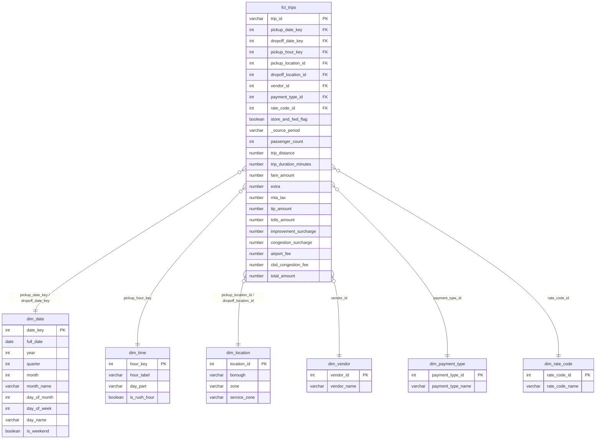

# Esquema estrella (GOLD)

**Grano de `fct_trips`:** un viaje válido (una fila de `silver_trips`).

- **Métricas:** passenger_count, trip_distance, trip_duration_minutes, fare_amount, extra, mta_tax, tip_amount, tolls_amount, improvement_surcharge, congestion_surcharge, airport_fee, cbd_congestion_fee, total_amount.
- **Atributos degenerados:** store_and_fwd_flag, _source_period.
- **Llaves:** naturales en las dimensiones (catálogos TLC pequeños y estables); miembros Unknown (-1, 5, 99) evitan FKs huérfanas.
